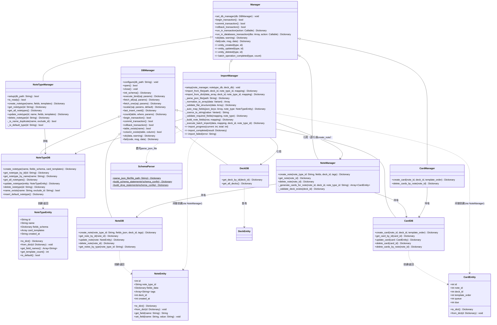
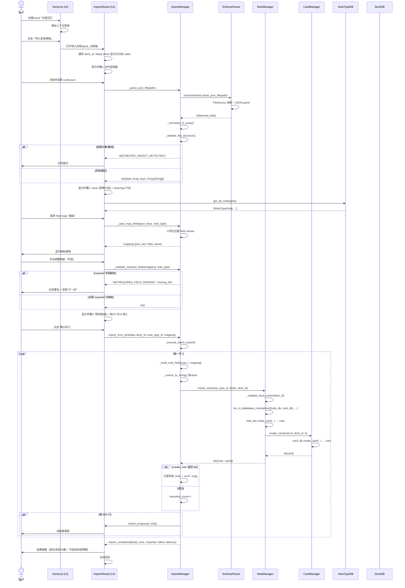
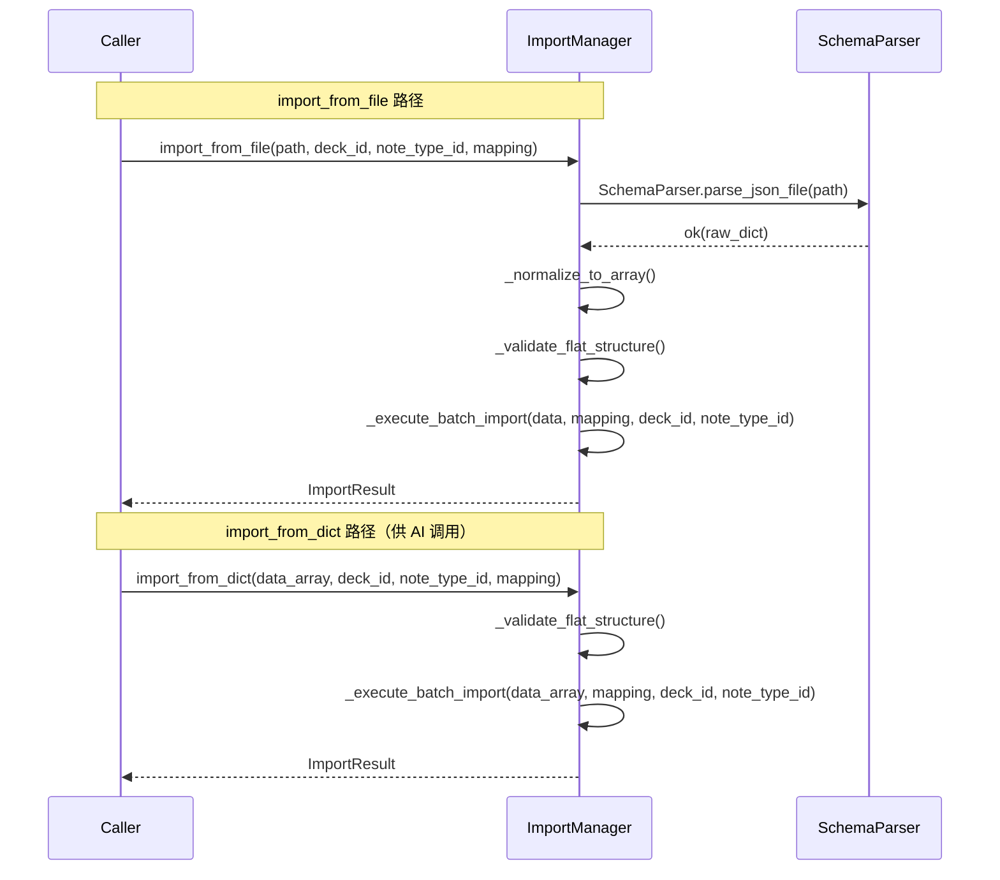
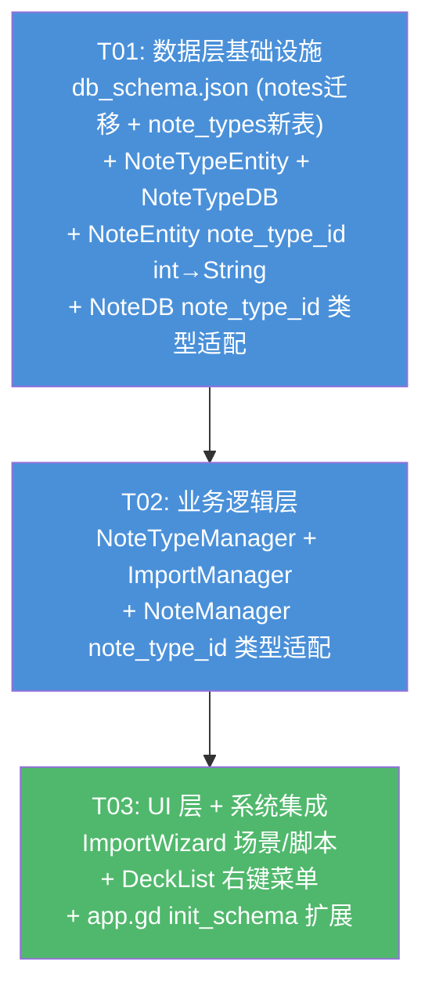

# KnowledgeAdmin JSON 批量导入 — 系统架构设计 v2.0

> **版本**: v2.0（基于 7 项已确认决策更新）  
> **作者**: Bob (Architect)  
> **日期**: 2025-07-08  

---

## Part A: 系统设计

---

### 1. 实现方案

#### 1.1 核心技术挑战

| 挑战 | 描述 | 决策 |
|------|------|------|
| JSON 文件解析 | 读取 + parse + 结构校验 | 委托已有 `SchemaParser.parse_json_file(path)` 完成文件读+JSON解析；ImportManager 外层追加 `_normalize_to_array()` + `_validate_flat_structure()` |
| 容错粒度 | 逐行失败不中断整体导入 | **逐行事务**：每行独立调用 `NoteManager.create_note()`（内部含 deck 校验 + 事务 + note 写入 + card 生成），失败行记录行号+错误 → 跳过 → 继续 |
| 智能字段映射 | JSON key（小写）与 NoteType field name（小写）模糊匹配 | 构建小写→原始名双向查找表；未映射 key 默认忽略；用户可手动覆盖 |
| required 字段缺失 | 阻止导入前必须在预览阶段检测 | `_validate_required_fields()` 对比 mapping 覆盖的字段与 note_type 全部字段 |
| note_type_id 类型迁移 | 当前 notes.note_type_id 为 INTEGER，需改为 TEXT | 重建 notes 表（`ALTER TABLE RENAME` → `CREATE TABLE` → `INSERT ... SELECT`），回填 `"__default__"`。迁移逻辑放在 T01 的 init_schema() 扩展中 |
| 默认 NoteType | 新数据库无 NoteType 时无法创建 note | `init_schema()` 中 `INSERT OR IGNORE` 创建 `id="__default__"` 的"基础"类型，不可删除 |
| 双接口设计 | `import_from_file` + `import_from_dict` | 两者共享 `_execute_batch_import()` 核心，仅入口不同 |
| 导入入口 | 从 Deck 右键菜单触发 | Deck 右键菜单「导入到本牌组」→ 打开向导并预填 Deck（Step2 Deck 下拉变为只读预填） |

#### 1.2 架构模式

遵循现有分层架构，不引入新模式：

```
Entity (RefCounted, 纯数据)
   ↓
DB 层 (extends DBManager, SQL 执行)
   ↓
Manager 层 (extends Manager, 事务编排 + 业务校验)
   ↓
UI 层 (场景 + 脚本, 用户交互)
```

ImportManager 作为 **跨仓库编排者**：持有 NoteManager / NoteTypeDB / DeckDB 引用。导入时逐行调用 `note_manager.create_note()`，该调用内部已完成 note+card 的事务写入——ImportManager 无需直接操作 DB 层。

#### 1.3 关键设计决策

1. **逐行容错而非批量回滚** — 每行独立事务（`create_note()` 自带事务），失败跳过继续。`batch_size=500` 仅控制进度信号发射频率。
2. **复用 NoteManager.create_note()** — ImportManager 不直接操作 NoteDB/CardDB。create_note() 内部已含 desk 校验 + fields 校验 + 事务 + note 写入 + card 生成。
3. **SchemaParser 复用** — JSON 文件读取和解析委托给已有的 `SchemaParser.parse_json_file(path)`，ImportManager 仅追加 `_normalize_to_array()` 和 `_validate_flat_structure()`。
4. **mapping 字典格式**: `{json_key: note_type_field_name}` — 单向映射，未在 mapping 中的 JSON key 忽略不导入。
5. **类型转换**: 所有非字符串值统一 `str()` 转为 string，含 `null` → `"null"`，`false` → `"false"`。
6. **note_types.id 使用固定 UUID** — 默认 `"__default__"`，新建通过 `Time.get_ticks_msec()+randi()` 生成唯一字符串。
7. **card_templates 预留不驱动** — 字段存储完整 JSON 但 MVP 不用于卡片生成。1 JSON 行 → 1 note → 1 card（`template_order=0`）。
8. **Deck 预填不可更改** — 导入向导 Step2 的 Deck 选择器从右键菜单传入 deck_id 预填，显示为只读 Label，确保导入目标不可偏离。

---

### 2. 文件列表

#### 2.1 新增文件

| 相对路径 | 职责 |
|----------|------|
| `src/entities/notetype_entity.gd` | NoteType 实体类 — 封装 note_types 表行，id/name/fields_schema/card_templates/created_at，JSON 序列化/反序列化，字段名提取 |
| `scenes/data_access/notetype_db.gd` | NoteTypeDB — note_types 表 CRUD，extends DBManager。含 name_exists() 去重检查 |
| `scenes/business_logic/notetype_manager.gd` | NoteTypeManager — NoteType 业务逻辑（名称唯一性校验、默认类型保护、增删改查），extends Manager |
| `scenes/business_logic/import_manager.gd` | ImportManager — JSON 解析+校验+映射+逐行导入+进度反馈，extends Manager |
| `scenes/ui/import_wizard.tscn` | 导入向导场景 — 三步骤 UI 容器（文件选择 → 映射配置 → 预览确认） |
| `scenes/ui/import_wizard.gd` | 导入向导控制器 — 步骤状态机、信号连接、调用 ImportManager API |

#### 2.2 修改文件

| 相对路径 | 修改内容 |
|----------|----------|
| `data/db_schema.json` | ① notes.note_type_id: `INTEGER NOT NULL` → `TEXT NOT NULL`；② 新增 `note_types` 表 + 索引；③ `drop_tables_order` 追加 `"note_types"` |
| `src/entities/note_entity.gd` | `note_type_id` 类型从 `int` 改为 `String`，默认值 `0` → `""`；`to_dict()`/`from_dict()` 适配 String |
| `scenes/data_access/note_db.gd` | `create_note()` / `get_notes_by_type()` 的 `note_type_id` 参数从 `int` 改为 `String`；校验从 `<= 0` 改为 `is_empty()` |
| `scenes/business_logic/note_manager.gd` | `create_note()` / `_generate_cards_for_note()` 的 `note_type_id` 参数从 `int` 改为 `String`；校验从 `<= 0` 改为 `.is_empty()` |
| `scenes/business_logic/card_manager.gd` | 无结构性变更（仅作为 ImportManager 间接调用路径上的被调用方，无需新增方法） |
| `scenes/data_access/card_db.gd` | 无结构性变更（ImportManager 不再直接调用） |
| `src/app.gd` | 扩展 init_schema 以包含 note_type_id 迁移 + 默认 NoteType 插入逻辑；或通过 DBManager 扩展点实现 |

---

### 3. 数据结构和接口

#### 3.1 类图



#### 3.2 ImportResult 结构

```gdscript
# ImportManager 导入完成后的统一结果结构
{
    "success": true,            # bool — 整体是否有致命错误（如文件解析失败）
    "total_rows": 100,          # int — JSON 总行数
    "imported": 92,             # int — 成功导入行数
    "failed": 8,                # int — 失败行数
    "failures": [               # Array[Dictionary] — 失败明细（可滚动列表）
        {"row": 3, "error": "required 字段缺失: 正面"},
        {"row": 7, "error": "deck_id 无效"}
    ],
    "warnings": [               # Array[String] — 非致命警告
        "第 5 行 boolean 值已转为 string"
    ]
}
# 成功部分已静默入库，不通过率无警告阈值。
```

#### 3.3 Mapping 字典格式

```gdscript
# mapping: {json_key: note_type_field_name}
# 示例:
{
    "front": "正面",      # JSON key "front" → NoteType field "正面"
    "back": "背面",       # JSON key "back" → NoteType field "背面"
}
# 未出现在 mapping 中的 JSON key → 忽略不导入
# mapping 中未覆盖 NoteType 的 required 字段 → 红色警告阻止导入
```

#### 3.4 note_types 表 Schema

```json
{
  "note_types": {
    "columns": {
      "id":             { "data_type": "TEXT", "primary_key": true },
      "name":           { "data_type": "TEXT", "not_null": true, "unique": true },
      "fields_schema":  { "data_type": "TEXT", "not_null": true },
      "card_templates": { "data_type": "TEXT", "not_null": true },
      "created_at":     { "data_type": "TEXT", "not_null": true }
    }
  }
}
```

**fields_schema JSON 内部结构** (默认 NoteType):
```json
[
  {"name": "正面", "order": 0},
  {"name": "背面", "order": 1}
]
```

**card_templates JSON 内部结构** (默认 NoteType，预留不驱动):
```json
[
  {"name": "正面→背面", "qfmt": "{{正面}}", "afmt": "{{背面}}"}
]
```

#### 3.5 notes 表 note_type_id 迁移方案

```
旧: note_type_id INTEGER NOT NULL
新: note_type_id TEXT NOT NULL

迁移步骤（在 init_schema() 扩展中执行）:
1. 检测 notes 表 note_type_id 列类型
2. 若为 INTEGER:
   a. ALTER TABLE notes RENAME TO notes_old
   b. CREATE TABLE notes (新 schema, note_type_id TEXT NOT NULL)
   c. INSERT INTO notes SELECT id, CAST(note_type_id AS TEXT), fields_data, deck_id, created_at FROM notes_old
   d. DROP TABLE notes_old
   e. 若存在 note_type_id=0 的行，UPDATE notes SET note_type_id = '__default__'
3. 若为 TEXT: 跳过迁移
```

---

### 4. 程序调用流程

#### 4.1 完整导入时序（从 Deck 右键菜单到卡片入库）



#### 4.2 import_from_file 与 import_from_dict 的关系



---

### 5. 待明确事项

| # | 事项 | 状态 |
|---|------|------|
| 1 | JSON 解析委托 SchemaParser | ✅ 已确认 (决策1) |
| 2 | 逐行容错而非批量 INSERT | ✅ 已确认 (决策2) |
| 3 | 默认 NoteType `"__default__"` | ✅ 已确认 (决策3) |
| 4 | 结果弹窗：计数 + 可滚动明细 | ✅ 已确认 (决策4) |
| 5 | card_templates 预留不驱动 | ✅ 已确认 (决策5) |
| 6 | note_type_id INTEGER→TEXT 迁移 | ✅ 已确认 (决策6) |
| 7 | Deck 右键菜单入口 + 预填 | ✅ 已确认 (决策7) |

---

## Part B: 任务分解

---

### 6. 依赖包列表

本项目无额外第三方依赖，全部基于：

```
- Godot 4.6 内置模块: JSON, FileAccess, Time
- godot-sqlite (addons/godot-sqlite/): SQLite 数据库
- GUT (addons/gut/): 单元测试框架（已有）
- SchemaParser (src/utils/schema_parser.gd): 已有 JSON 文件解析工具
```

---

### 7. 任务列表（按依赖排序，共 3 个任务）

#### T01: 数据层基础设施（Schema 迁移 + NoteTypeEntity + NoteTypeDB + NoteEntity 类型迁移）

- **Task ID**: T01
- **优先级**: P0
- **依赖**: 无
- **涉及文件**:
  - `data/db_schema.json` — **MODIFY**: ① notes.note_type_id 从 `INTEGER NOT NULL` → `TEXT NOT NULL`（移除 `default:0`）；② 新增 `note_types` 表定义（id TEXT PK, name TEXT UNIQUE NOT NULL, fields_schema TEXT NOT NULL, card_templates TEXT NOT NULL, created_at TEXT NOT NULL）；③ 新增索引 `idx_notetypes_name`（unique, on note_types(name)）；④ `drop_tables_order` 改为 `["cards","notes","note_types","decks"]`
  - `src/entities/notetype_entity.gd` — **NEW**: NoteTypeEntity（RefCounted）。属性: `id: String`, `name: String`, `fields_schema: Dictionary`（解析后的 `[{"name":"正面","order":0},...]` 数组）, `card_templates: Array`, `created_at: String`。方法: `to_dict()` / `from_dict(d)` / `get_field_names() → Array[String]` / `get_template_count() → int` / `get_required_fields() → Array[String]`（MVP 返回全部 field names）/ `is_default() → bool`
  - `scenes/data_access/notetype_db.gd` — **NEW**: NoteTypeDB（extends DBManager）。CRUD 方法: `create_notetype(name, fields_schema, card_templates) → Dictionary`（内部生成 UUID id）、`get_notetype_by_id(id: String)`、`get_notetype_by_name(name: String)`、`get_all_notetypes()`、`update_notetype(entity: NoteTypeEntity)`、`delete_notetype(id: String)`、`name_exists(name, exclude_id="") → bool`、`insert_default_notetype() → Dictionary`（`INSERT OR IGNORE INTO note_types(id,name,fields_schema,card_templates,created_at) VALUES('__default__','基础','[{"name":"正面","order":0},{"name":"背面","order":1}]','[{"name":"正面→背面","qfmt":"{{正面}}","afmt":"{{背面}}"}]','...')`）
  - `src/entities/note_entity.gd` — **MODIFY**: `note_type_id` 类型从 `int = 0` 改为 `String = ""`；`to_dict()` 中 `"note_type_id": note_type_id`（不再强制 int）；`from_dict()` 中 `note_type_id = str(d.get("note_type_id", ""))`；`get_default_deck_id()` 保持返回 0
  - `scenes/data_access/note_db.gd` — **MODIFY**: `create_note(note_type_id: String, ...)` 参数类型 int→String，校验 `note_type_id.is_empty()` 代替 `<= 0`；`get_notes_by_type(note_type_id: String)` 参数类型 int→String；内部 `_row_to_note_entity()` 无需改（依赖 NoteEntity.from_dict 自动适配）
- **产出物说明**:
  - **notes 表迁移逻辑**：在 `init_schema()` 扩展中执行（通过 `column_exists("notes", "note_type_id")` 判断当前列类型）。若当前为 INTEGER：`ALTER TABLE notes RENAME TO notes_old` → `CREATE TABLE notes(...)` 新 schema → `INSERT INTO notes SELECT id, CAST(note_type_id AS TEXT), fields_data, deck_id, created_at FROM notes_old` → `DROP TABLE notes_old` → `UPDATE notes SET note_type_id = '__default__' WHERE note_type_id = '0' OR note_type_id = ''`
  - 默认 NoteType `"__default__"` 在 `init_schema()` 建表后立即 `INSERT OR IGNORE`
  - NoteTypeEntity 的 `fields_schema` 解析为 `Array[Dictionary]`，供 UI 遍历生成映射下拉
- **验收标准**: 新数据库直接创建 note_types 表 + 默认行；旧数据库（INTEGER note_type_id）自动迁移成功且数据不丢失；NoteTypeDB CRUD 全路径可用；NoteEntity 的 note_type_id 可正确读写 String 值

#### T02: 业务逻辑层（NoteTypeManager + ImportManager + NoteManager 类型适配）

- **Task ID**: T02
- **优先级**: P0
- **依赖**: T01
- **涉及文件**:
  - `scenes/business_logic/notetype_manager.gd` — **NEW**: NoteTypeManager（extends Manager）。setup(db_path) 初始化 NoteTypeDB → 调用 `insert_default_notetype()`；CRUD 包装 NoteTypeDB 方法；`delete_notetype()` 内检查 `_is_default_type(id)` 阻止删除默认类型；信号 entity_created/updated/deleted("notetype", id)
  - `scenes/business_logic/import_manager.gd` — **NEW**: ImportManager（extends Manager）。核心方法:
    * `setup(note_manager: NoteManager, notetype_db: NoteTypeDB, deck_db: DeckDB) → void`
    * `import_from_file(path, deck_id, note_type_id, mapping) → Dictionary`
    * `import_from_dict(data_array: Array, deck_id, note_type_id, mapping) → Dictionary`
    * `_parse_json_file(path) → Dictionary` — 委托 `SchemaParser.parse_json_file(path)`，追加 `_normalize_to_array()` + `_validate_flat_structure()`
    * `_normalize_to_array(data) → Array` — 单对象 `{...}` 自动包裹为 `[{...}]`
    * `_validate_flat_structure(data: Array) → Dictionary` — 遍历每个 value，`typeof()` 检测 TYPE_DICTIONARY/TYPE_ARRAY → 发现则 fail
    * `_auto_map_fields(json_keys: Array, note_type: NoteTypeEntity) → Dictionary` — 小写查找表，匹配优先级: 完全相等 > 包含匹配 > 未匹配
    * `_coerce_to_string(value: Variant) → String` — TYPE_BOOL → "true"/"false"，TYPE_NIL → "null"，TYPE_INT/TYPE_FLOAT → str()
    * `_validate_required_fields(mapping, note_type) → Dictionary` — 对比 note_type.get_field_names() 是否全部在 mapping.values() 中出现
    * `_build_note_fields(row: Dictionary, mapping: Dictionary) → Dictionary` — 按 mapping 提取并转换
    * `_execute_batch_import(data, mapping, deck_id, note_type_id) → Dictionary` — **逐行循环**: 每行 try/catch 包裹 `note_manager.create_note(note_type_id, fields, deck_id)`；成功 → imported++；失败 → 记录 `{row, error}`；每 500 行 emit `import_progress`；最终 emit `import_completed`
  - `scenes/business_logic/note_manager.gd` — **MODIFY**: `create_note(note_type_id: String, ...)` 参数 int→String，校验 `note_type_id.is_empty()` 代替 `<= 0`；`_generate_cards_for_note(note_id, deck_id, note_type_id: String)` 参数 int→String，校验 `note_type_id.is_empty()` 代替 `<= 0`
  - `scenes/business_logic/card_manager.gd` — **无结构性变更**（ImportManager 不直接调 CardManager，路径走 NoteManager → CardManager）
- **产出物说明**:
  - ImportManager 不持有 NoteDB/CardDB 引用——所有 DB 操作通过 `note_manager.create_note()` 间接完成
  - `_execute_batch_import()` 对每行调用 `create_note()`，单个失败记录后 continue，不中断后续行
  - 进度信号: `import_progress(current: int, total: int)`，每 500 行（或最后一小批）发射
  - 完成信号: `import_completed(result: Dictionary)`，result 格式见 §3.2
- **验收标准**: ImportManager 正确解析 sample JSON（数组/单对象），auto_map 匹配率正确，required 缺失正确拦截；逐行导入中故意插入错误行能正确跳过并记录；进度信号发射频率正确；import_completed 结果包含完整 success/failed/failures 统计

#### T03: UI 层 + 系统集成（ImportWizard + Deck 右键菜单 + app.gd 注册）

- **Task ID**: T03
- **优先级**: P0
- **依赖**: T02
- **涉及文件**:
  - `scenes/ui/import_wizard.tscn` — **NEW**: 三步骤向导 UI 场景。
    * Step1 容器: FileDialog 按钮 + 已选文件路径 Label
    * Step2 容器: Deck Label (只读预填) + OptionButton(NoteType 列表，首位标注"默认"设 `__default__`) + 映射 GridContainer（每行: JSON key Label | "→" Icon | NoteType field OptionButton）+ required 缺失警告 Label(红色)
    * Step3 容器: 预览 Tree（前 5 条，列由 mapping 动态生成）+ 统计行 "共 N 条" + ProgressBar + "确认导入" Button
    * 结果弹窗: AcceptDialog（`"成功: X 条 | 失败: Y 条"` + ScrollContainer 内 Label 列出失败明细 "行号: 错误原因"）
  - `scenes/ui/import_wizard.gd` — **NEW**: 控制器脚本。
    * 属性: `_step: int`（1/2/3）, `_deck_id: int`（构造时注入）, `_parsed_data: Array`, `_mapping: Dictionary`, `_notetype_id: String`
    * Step1 → Step2: `_on_file_selected(path)` → `import_manager._parse_json_file(path)` → 缓存 → 显示 Step2
    * Step2 初始化: 加载 NoteType 列表（调用 `notetype_db.get_all_notetypes()`），Deck Label 显示预填 deck 名称（`deck_db.get_deck_by_id(_deck_id)`）
    * Step2 → Step3: `_on_mapping_confirmed()` → `import_manager._auto_map_fields()` + `import_manager._validate_required_fields()` → 缓存 mapping → 显示预览
    * Step3 → 导入: `_on_import_confirmed()` → `import_manager.import_from_dict()` → 连接 `import_progress` 信号更新 ProgressBar → 连接 `import_completed` 信号显示结果弹窗
  - `scenes/ui/deck_list.gd` — **MODIFY**: 在 Deck Tree 的右键菜单（`_on_tree_item_right_clicked` 或类似方法）中新增菜单项「导入到本牌组」，点击后实例化 ImportWizard 场景并传入 `deck_id`
  - `src/app.gd` — **MODIFY**: 扩展 init_schema() 调用链：① 确保 NoteTypeDB 在 schema 初始化阶段被调用（含默认 NoteType 插入）；② 可选注册 ImportManager 单例或由 ImportWizard 按需实例化（建议由 ImportWizard 按需实例化，避免 Autoload 膨胀）
- **产出物说明**:
  - Deck 右键菜单: 在已有右键处理逻辑中追加 `popup.add_item("导入到本牌组")` → 点击后 `ImportWizard.new(deck_id)` 并 `add_child()` 或弹出
  - ImportWizard 构造时接收 `deck_id: int`，Step2 中 Deck 显示为 `Label(text=deck_name)` 不可编辑
  - NoteType 下拉首位: `"基础 (默认)"` → value=`"__default__"`
  - 映射表格: 每个 JSON key 一行，右侧 OptionButton 列出 NoteType 全部字段 + "忽略"，自动匹配成功的预选对应字段
  - 结果弹窗: 成功静默，失败可滚动列表（行号 + 错误原因）
- **验收标准**: 完整端到端流程: Deck 右键 → 向导打开(Deck预填) → 选 JSON → 自动映射 → 手动调整 → 预览 → 导入 → 进度条 → 结果弹窗 → 数据库中出现新 notes/cards；失败行正确记录在结果弹窗滚动列表中

---

### 8. 共享知识（跨文件约定）

#### 8.1 JSON Key 命名规范

```
- JSON key 全部按小写匹配（case-insensitive）
- 自动映射优先级：完全相等（小写 vs 小写）> 单边包含 > 未匹配
- 未匹配的 JSON key 默认"忽略"（用户可手动改选 NoteType 字段）
```

#### 8.2 Mapping 字典格式

```gdscript
# 全局统一格式
var mapping: Dictionary = {
    "json_key_lowercase": "NoteTypeFieldName"  # 值使用 NoteType 原始字段名（保留大小写）
}
# 示例: {"front": "正面", "back": "背面"}
# mapping.values() 必须覆盖 note_type.get_field_names() 的全部元素，否则阻断导入
```

#### 8.3 错误码约定

| 错误码 | 含义 | 触发场景 |
|--------|------|----------|
| `JSON_FILE_NOT_FOUND` | 文件不存在 | SchemaParser 返回 |
| `JSON_PARSE_FAILED` | JSON 格式错误 | SchemaParser 返回 |
| `JSON_NOT_ARRAY_OR_OBJECT` | 顶层不是数组或对象 | 解析结果既非 Array 也非 Dictionary（在 SchemaParser 已校验顶层 Dictionary 的情况少见） |
| `NESTED_OBJECT_DETECTED` | 检测到嵌套结构 | value 的 typeof 为 TYPE_DICTIONARY 或 TYPE_ARRAY |
| `REQUIRED_FIELD_MISSING` | 必填字段未映射 | mapping.values() 未覆盖 note_type.get_field_names() 全部元素 |
| `NOTE_TYPE_NOT_FOUND` | NoteType 不存在 | NoteTypeDB 查询无结果 |
| `DECK_NOT_FOUND` | 牌组不存在 | DeckDB 查询无结果 |
| `IMPORT_PARTIAL` | 部分导入成功 | `failed > 0` 且 `imported > 0`（用于 import_completed 信号） |

#### 8.4 信号约定

```gdscript
# ImportManager 信号
import_progress(current: int, total: int)    # 每 500 行发射一次
import_completed(result: Dictionary)          # 全部完成后发射（result 格式见 §3.2）
import_failed(error: String)                  # 致命错误时发射（文件解析失败等）

# NoteTypeManager 继承 Manager 的标准信号
entity_created("notetype", id: String)
entity_updated("notetype", id: String)
entity_deleted("notetype", id: String)

# NoteManager 现有信号（通过 Manager 基类）
entity_created("note", id: int)               # create_note() 内部发射
batch_operation_completed("card", count: int) # _generate_cards_for_note() 内部发射
```

#### 8.5 统一返回格式

```gdscript
# 全项目所有方法统一使用：
{"success": bool, "data": Variant, "error": String, "code": String, "warning": String}

# DB 层通过 DBManager.ok(data, warning) / DBManager.fail(code, msg, data) 构造
# Manager 层通过 Manager.ok(data, warning) / Manager.fail(code, msg, data) 构造
# 事务内方法必须返回此格式，以便 run_in_transaction 正确判断 commit/rollback
```

#### 8.6 时间戳格式

```
- notes.created_at: INTEGER (Unix 时间戳，秒级) — 沿用现有格式
- note_types.created_at: TEXT (ISO 8601 字符串) — 新表使用可读格式，如 "2025-07-08T12:00:00"
```

#### 8.7 默认 NoteType 约定

```gdscript
const DEFAULT_NOTETYPE_ID   := "__default__"
const DEFAULT_NOTETYPE_NAME := "基础"
const DEFAULT_FIELDS_SCHEMA := '[{"name":"正面","order":0},{"name":"背面","order":1}]'
const DEFAULT_CARD_TEMPLATES := '[{"name":"正面→背面","qfmt":"{{正面}}","afmt":"{{背面}}"}]'

# 判断是否为默认类型: notetype_entity.id == "__default__"
# 默认类型不可删除，不可修改 id
# UI 中 NoteType 下拉框首位显示 "基础 (默认)"
```

---

### 9. 任务依赖图


